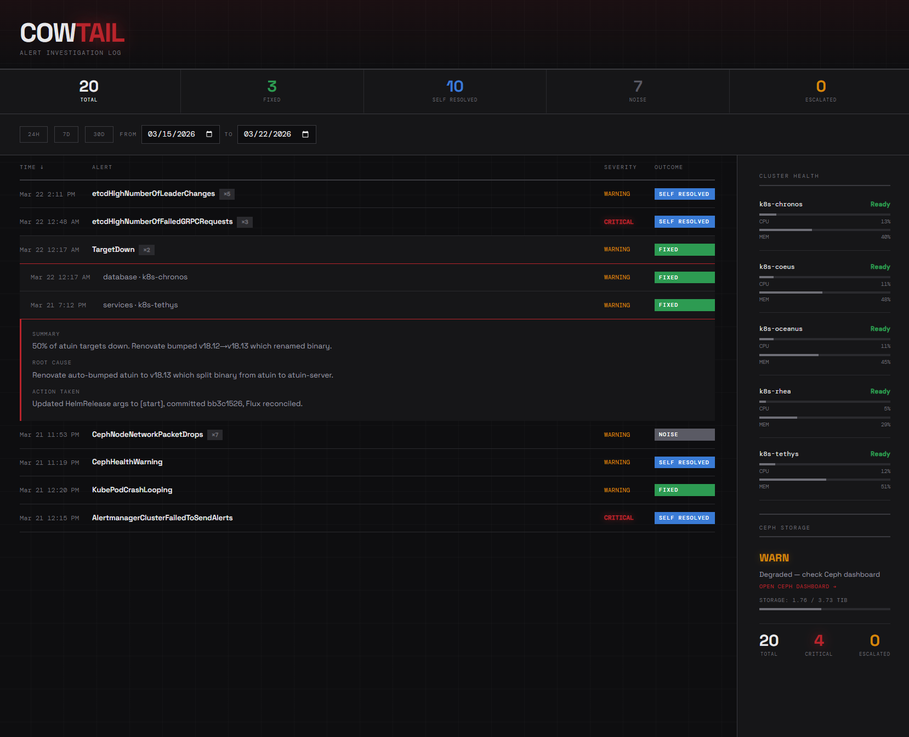

# Cowtail

Alert investigation log and cluster health dashboard for Kubernetes. Built to give visibility into what alerts fired, what caused them, and what was done about it.



> [!NOTE]
> Cowtail is a personal project built for a specific home lab setup. It's public so others can reference the patterns (nginx-proxied Convex, Prometheus cluster health, Alertmanager integration) but it's not designed as a general-purpose tool. Feel free to fork and adapt it to your own cluster.


## Features

- **Alert history** — every alert that fired, with timestamp, severity, namespace, outcome
- **Outcome tracking** — fixed, self-resolved, noise, escalated — with filterable stats
- **Grouped alerts** — repeated alerts grouped by name with expand/collapse
- **Date range picker** — presets (24h, 7d, 30d) or custom range with URL params
- **Cluster health** — live node CPU/memory, readiness status, Ceph storage from Prometheus
- **Digest page** — shareable summary view at `/digest?from=...&to=...`
- **Email digest** — pre-rendered HTML endpoint for automated email reports
- **Mobile layout** — responsive with bottom-sheet cluster health panel
- **PWA** — installable with custom icon

## Architecture

```
Browser ──→ nginx ──→ Static files (Vite build)
                  ├──→ /api/       → Convex backend (WebSocket sync + queries)
                  ├──→ /actions/   → Convex HTTP actions (alert writes)
                  └──→ /prometheus/→ Prometheus API (cluster health)
```

- **Frontend**: React + TypeScript + Tailwind CSS + Vite
- **Data**: [Convex](https://convex.dev) (self-hosted) — real-time sync via WebSocket
- **Queries**: TanStack Query + `@convex-dev/react-query`
- **Cluster health**: Prometheus queries proxied through nginx
- **Deployment**: Docker (nginx:alpine) on Kubernetes

## Setup

### Prerequisites

- Node.js 22+ or Bun
- A [Convex](https://convex.dev) deployment (cloud or self-hosted)
- Prometheus (for cluster health panel)

### Development

```bash
cp .env.example .env
# Edit .env with your Convex URL

bun install
bun run dev
```

### Deploy to Kubernetes

1. **Build the Docker image:**
   ```bash
   docker build -t cowtail .
   ```

2. **Update `nginx.conf`** with your Convex and Prometheus service URLs.

3. **Set environment variables** for the Convex HTTP actions:
   - `SITE_ORIGIN` — your Cowtail URL (used in digest email links)

4. **Deploy** using the HelmRelease in your GitOps repo, or any Kubernetes deployment method.

### Writing alerts

POST alerts to the Convex HTTP action endpoint:

```bash
curl -X POST https://your-cowtail-instance/actions/api/alerts \
  -H "Content-Type: application/json" \
  -d '{
    "alertname": "KubePodCrashLooping",
    "severity": "warning",
    "namespace": "default",
    "node": "worker-01",
    "status": "resolved",
    "outcome": "fixed",
    "summary": "Pod restarting due to OOM",
    "action": "Increased memory limit to 512Mi",
    "rootCause": "Memory limit too low for workload",
    "messaged": false
  }'
```

## Design

Swiss dark mode — dark background, red accents, Space Grotesk + DM Mono, grid precision.

## License

[MIT](LICENSE)
